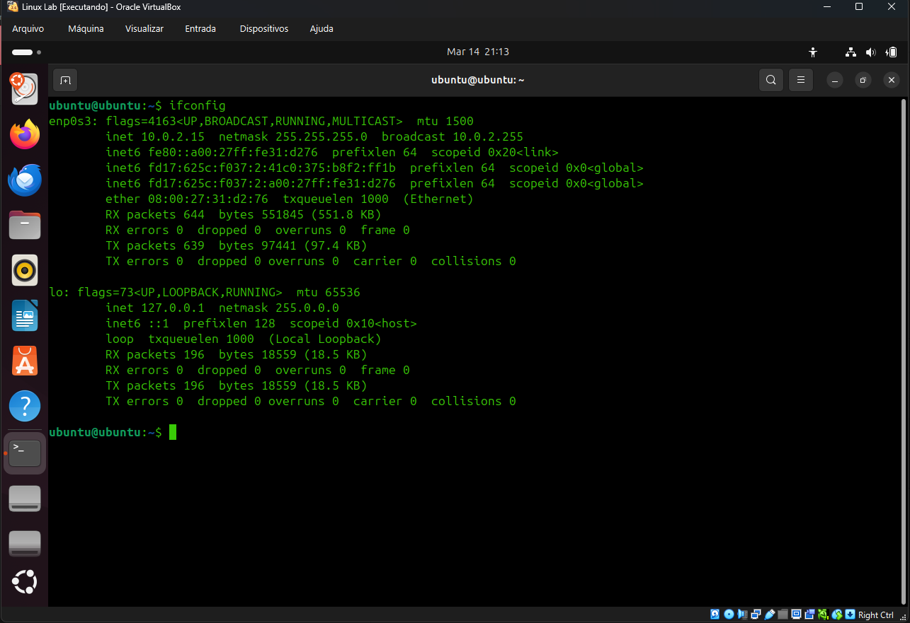
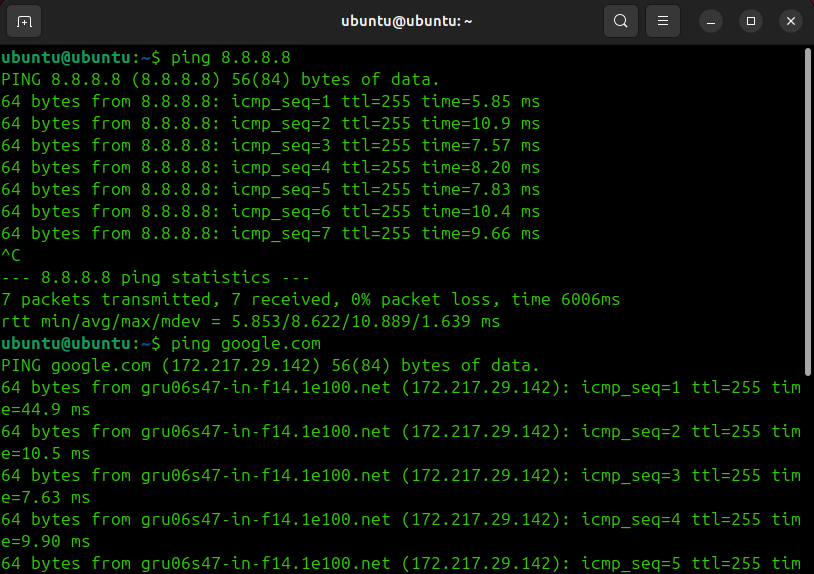
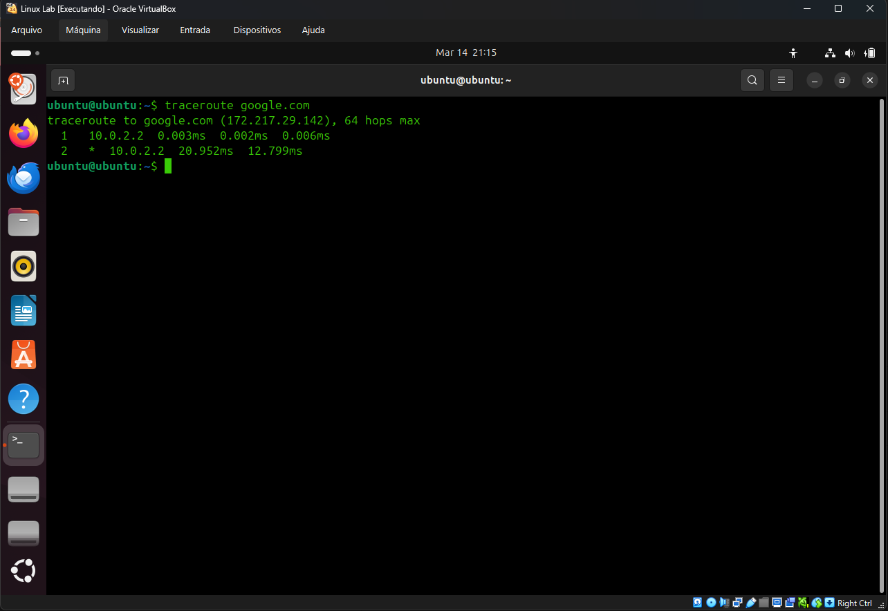
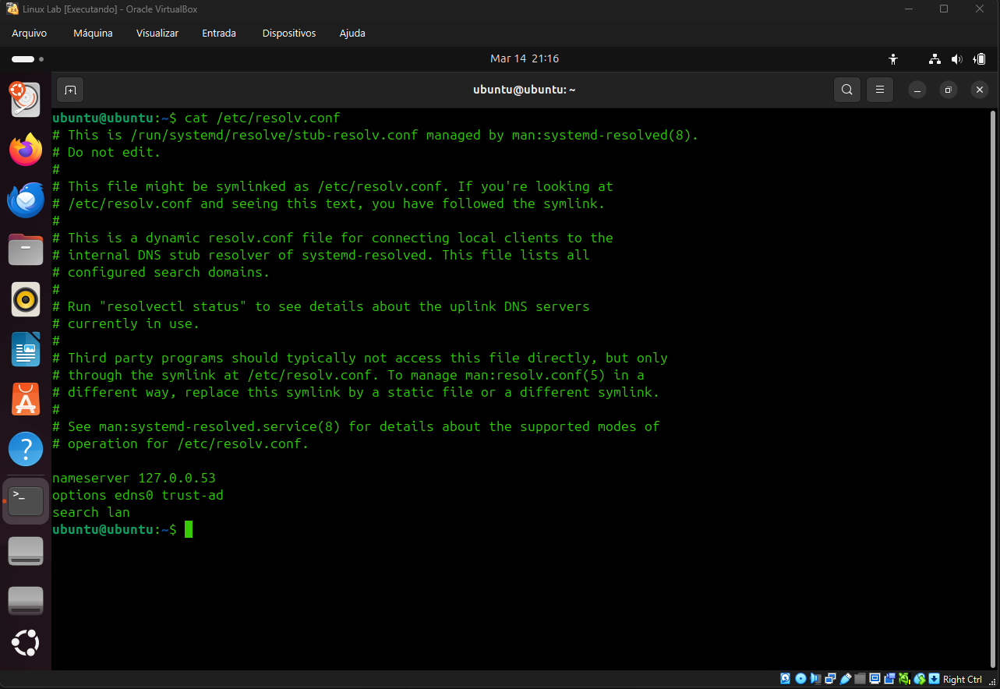
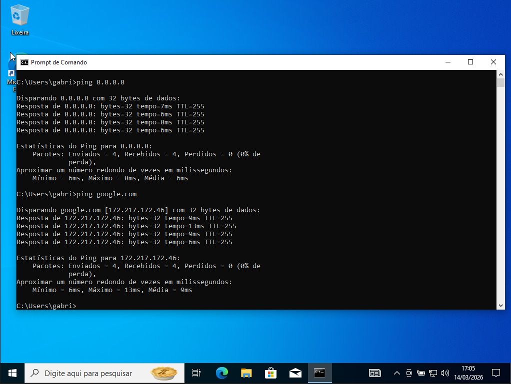
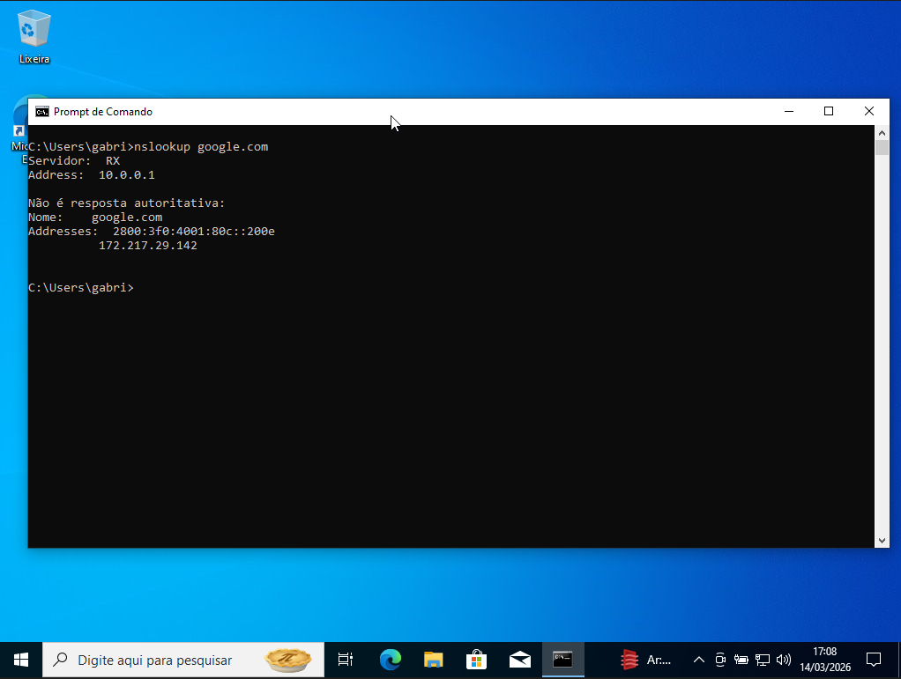

# 🌐 Network Diagnostics Lab

Laboratório prático de diagnóstico de rede utilizando máquinas virtuais para testar conectividade e ferramentas básicas de troubleshooting.

O objetivo deste laboratório é praticar comandos utilizados no dia a dia de profissionais de suporte e infraestrutura.

---
## 🛠️ Tecnologias Utilizadas

- Virtualização com VirtualBox
- Sistema operacional Linux
- Sistema operacional Windows
- Ferramentas de diagnóstico de rede

---

## 🔎 Comandos Utilizados

### Linux
- ip a
- ping
- traceroute
- cat/etc/resolv.conf

### Windows
- ipconfig
- ping
- tracert
- nslookup

---
## 💻 Testes no Linux

### Ver endereço IP

### Teste de ping

### Traceroute

### Ver DNS

## 🪟 Testes no Windows

### IPConfig

### Teste de Ping

### Tracert

### Ver DNS

## 📚 Aprendizados

Durante este laboratório foi possível praticar:

- Identificação de endereço IP
- Teste de conectividade de rede
- Análise de rotas entre dispositivos
- Uso de ferramentas básicas de troubleshooting

Essas ferramentas são muito utilizadas em atividades de suporte técnico e help desk.
